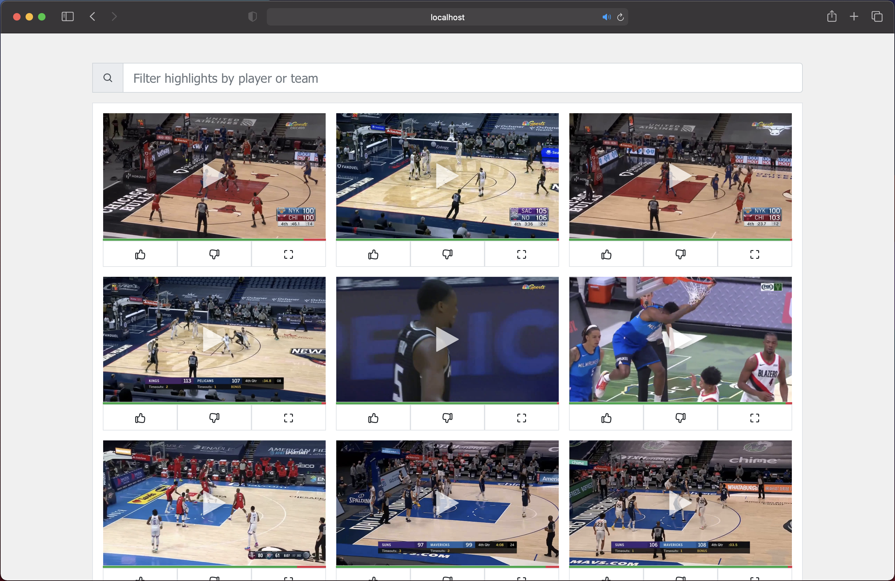
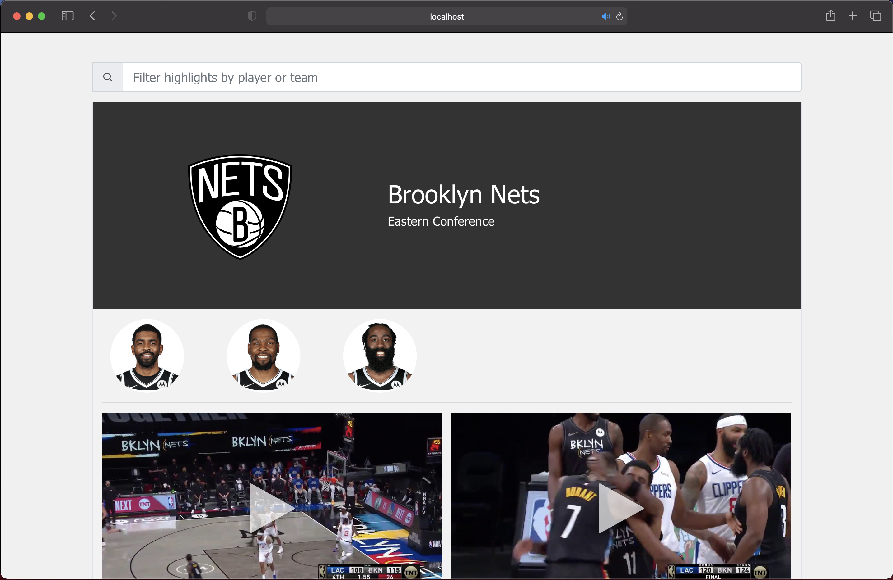
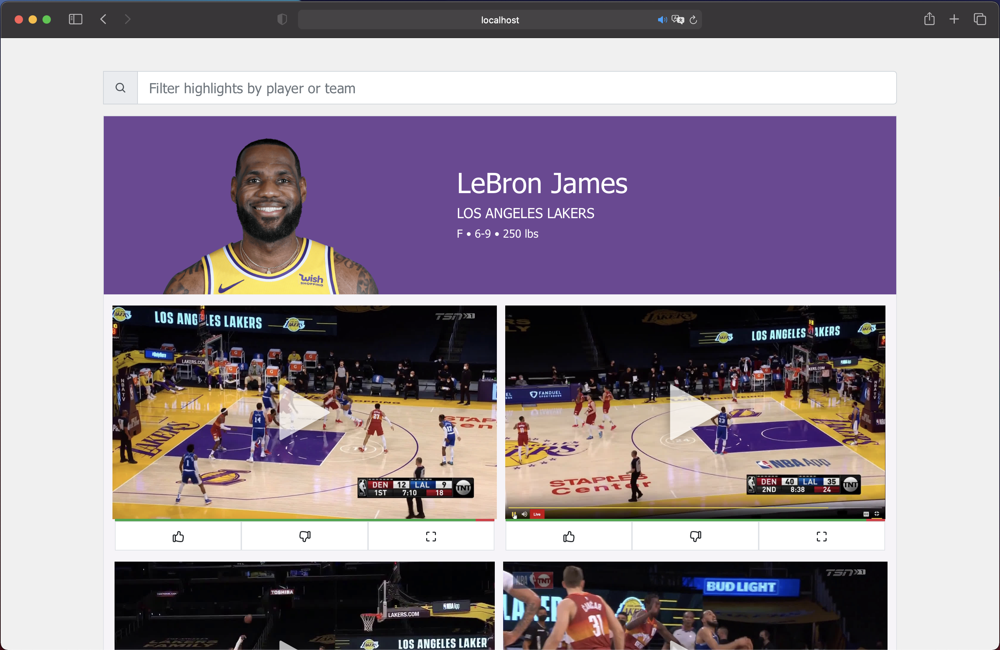

# Highlights

A web app that fetches NBA highlights from Reddit and classifies them by player/team/type!

[Overview](#Overview) | [Screenshots](#screenshots) | [Quick Start](#quick-start)

## Overview

The Flask server is responsible for:
* Scraping video highlights from r/NBA on Reddit
* Parsing highlight information (i.e. titles, dates, upvotes)
* Applying NLP to identify which players and teams are in the videos
* Pushing processed videos to MongoDB tables

The React app serves as a interface by:
* Pulling video sources, team info, player info, etc. from MongoDB
* Providing embedded video players with ability to sort and filter highlights by player/team/type

## Screenshots

**Home page**: See most recent highlights across the NBA

**Team page**: See most recent highlights from a certain team

**Player page**: See most recent highlights from a certain player

## Quick Start

This app has a backend compoment built in Flask, and a frontend built in React. To run locally, follow the steps below.

### Flask backend

First, create a file `config.py` in the path `/be-flask-server/highlights_server/`. (This has been omitted in the repo for privacy pruposes). Within this file, there should be 3 constant declarations storing the MongoDB host URIs for the requried databases:
* `HIGHLIGHTS_DB_URI`
* `PLAYERS_DB_URI`
* `TEAMS_DB_URI`

To start the server:
1. Go to the `be-flask-server` directory
2. Run the command `export FLASK_APP=highlights_server` to set the env variable for Flask
3. Run the command `flask run`

By default, the server should now be running on http://127.0.0.1:5000/!

### React frontend

To start the app:
1. Go to the `fe-react-app` directory in a separate terminal session
2. Run the command `npm run start`

By default, the app should now be running on http://localhost:3000/!
